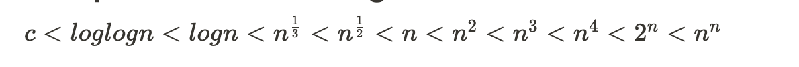

# Analysis of algorithms

### Definition

There are many important things that should be taken care of, like user-friendliness, modularity, security, maintainability, etc. Why worry about performance? The answer to this is simple, we can have all the above things only if we have performance. So performance is like currency through which we can buy all the above things. Another reason for studying performance is – speed is fun! To summarize, performance == scale. Imagine a text editor that can load 1000 pages, but can spell check 1 page per minute OR an image editor that takes 1 hour to rotate your image 90 degrees left OR … you get it. If a software feature can not cope with the scale of tasks users need to perform – it is as good as dead.

Generally, there is always more than one way to solve a problem in computer science with different algorithms. Therefore, it’s highly required to use a method to compare the solutions in order to judge which one is more optimal

- The method must be Independent of the machine and its configuration, on which the algorithm is running on.
- It should show a direct correlation with the number of inputs
- It can distinguish two algorithms clearly without ambiguity.

There are two such methods used, time complexity and space complexity.

Time and space complexity depends on lot of things like hardware, operating system, processors, etc. However, we don’t consider any of these factors while analyzing the algorithm. We will only consider the execution time of an algorithm.

# Time Complexity

Function that gives use the relationship about how time will grow as the input grows.

Time complexity is not equal to time taken.

The time complexity of an algorithm quantifies the amount of time taken by an algorithm to run as a function of the length of the input.

Note that the time to run is a function of the length of the input and not the actual execution time of the machine on which the algorithm is running on.

### Asymptotic Analysis

To measure order of growth of time taken by a function or program in terms of input size.

It doesn’t depend upon the machine, programming language etc.

In Asymptotic Analysis, we evaluate the performance of an algorithm in terms of input size (we don’t measure the actual running time). We calculate, how the time (or space) taken by an algorithm increases with the input size.

Asymptotic Analysis is not perfect, but that’s the best way available for analyzing algorithms. For example, say there are two sorting algorithms that take 1000nLogn and 2nLogn time respectively on a machine. Both of these algorithms are asymptotically the same (order of growth is nLogn). So, With Asymptotic Analysis, we can’t judge which one is better as we ignore constants in Asymptotic Analysis.

Also, in Asymptotic analysis, we always talk about input sizes larger than a constant value. It might be possible that those large inputs are never given to your software and an asymptotically slower algorithm always performs better for your particular situation. So, you may end up choosing an algorithm that is Asymptotically slower but faster for your software.

### Order of growth

It defines the amount of time taken by any program with respect to the size of the input.

Time complexity defines how the program would behave as the order of size of input is increased.

So, time complexity is just a function of size of the input.

## **Direct way to compare order of growths:**

- Ignore lower order of terms
- Ignore leading term constants.

Ex:  1.  $f(n) = 2n^2 + n + 6$ 

   Order of growth is : **n2**

2.  $g(n) = 100n + 3$ 

  Order of growth is : **n**

## Best, average and worst cases

It’s important to analyze an algorithm after writing it to find its efficiency in terms of time and space in order to improve it if possible.

When it comes to analyzing algorithms, the asymptotic analysis seems to be best way possible to do so. This is because asymptotic analysis analyzes algorithms in terms of the input size. It checks how are the time and space growing in terms of the input size.

We can have 3 cases to analyze the algorithm.

1. **Worst case analysis (Mostly used):** In the worst case analysis, we calculate upper bound on running time of an algorithm. We must know the case that causes the maximum number of operations to be executed. Most of the times, we do the worst case analysis to analyze algorithms. In this analysis we guarantee an upper bound on the running time of an algorithm which is a good of information.
2. **Average Case Analysis (Rarely used) :** In Average analysis, we take all the possible inputs and calculate computing time for all the inputs, sum all the calculated values and divide the sum by total number of inputs. In this case, we must know (or predict) distribution of cases. The average case analysis is not easy to do in most of the practical cases and its rarely done. In this analysis, we must know (or predict) the mathematical distribution of all possible inputs.
3. **Best Case Analysis (Very rarely used) :** In the best case analysis, we calculate the lower bound on running time of an algorithm. We must know the cases that causes minimum number of operations to be executed. The best case analysis is bogus. Guaranteeing a lower bound on an running time of an algorithm doesn’t provide any information as in the worst case, an algorithm may take years to run.

### What do we consider when thinking about complexity

1. Always look for the worst case complexity.
2. Always look for complexity for large or infinite data.
3. We don’t actually care about what the actual time taken, because that varies based on computers, programming languages etc. We only care about how time is growing as the input grows.
4. Always ignore all constants and less dominant terms.

## Common complexities

**Constant time complexity - $O(1)$** :

- If an algorithm’s time complexity is constant, it means that it will always run in same amount of time, no matter the input size.

**Logarithmic complexity - $O(log n)$ :**

- An algorithm is said to have a logarithmic time complexity when it reduces the size of the input data in each step.
- This indicates that the number of operations is not same as the input size. The number of operations gets reduced as the input size increases.

**Linear time complexity - $O(n)$:**

- It means that the runtime of the algorithm grows almost linearly with the input size.

 **Log-Linear complexity -** $O(n logn)$:

- It’s **n**, a linear time complexity, multiplied by log **n** a logarithmic time complexity.

**Quadratic time complexity** - $O(n^2)$ :

- If an algorithm’s time complexity is quadratic, it means that the runtime of the algorithm is directly proportional to the square of the size of the input.

**Cubic time complexity** - $O(n^3)$ :

- An algorithm is said to run in cubic time, if the running time of the three loops is proportional to the cube of N. The running time increases by N * N * N

**Exponential time complexity - $O(2^n)$ :**

- If an algorithm time complexity is exponential, it’s runtime is doubled after every addition to the input size.
- If 5 times took 30 seconds, 6 items would take 60 seconds.

## Comparison of order of growth terms:

## Asymptotic Notations

### 1. Theta Notation

Theta notation represents the exact bound of the running time of an algorithm.

Theta notation encloses the function from above and below. Since it represents the upper and the lower bound of the running time of an algorithm, it is used for analyzing the average-case complexity of an algorithm.

This notation is rarely used.

### 2. Omega Notation

Omega notation represents the lower bound of the running time of an algorithm. Thus, it provides the best case complexity of an algorithm.

This can be useful, when we have lower bound on time complexity of an algorithm.

This notation is the least used among all three.

### 3. Big O Notation

The Big ‘O’ notation defines an upper bound of an algorithm. Therefore, it gives the worst-case complexity of an algorithm.

It bounds a function only from above.

The Big O Notation is useful when we only have upper bound on time complexity of an algorithm.

Many times we easily find an upper bound by simply lookin at the algorithm.

It is the most widely used notation for Asymptotic analysis

# Space Complexity

Space complexity of an algorithm is the total space taken by the algorithm with respect to the input size.

Space complexity includes both auxiliary space and space used by input.

Space complexity refers to the total amount of memory space used by an algorithm/program, including the space of input values for execution. Calculate the space occupied by variables in an algorithm/program to determine space complexity.

However, people frequently confuse Space-complexity with auxiliary space. Auxiliary space is simply extra or temporary space, and it is not the same as space complexity. To put it another way

Auxiliary space + space use by input values = Space Complexity

Auxiliary space is the extra space or temporary space used by an algorithm. For example if we want to compare standard algorithms on the basis of space, then auxiliary space would be a better criterion than space complexity. Merge sort uses O(n) auxiliary space, insertion sort and heap sort use O(1) auxiliary space.

Space complexity is parallel to time complexity. If we need to create an array of size N, this will require O(n) space. If we create a 2D array of size n*n, this require O(n2) space.

In recursive calls stack space also counts.

It’s important to note that space complexity depends on a variety of things such as the programming language, the compiler, or even the machine running the algorithm.
