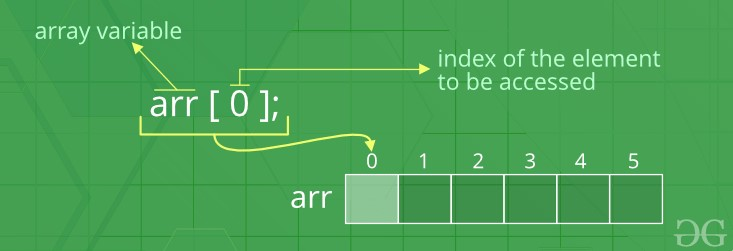
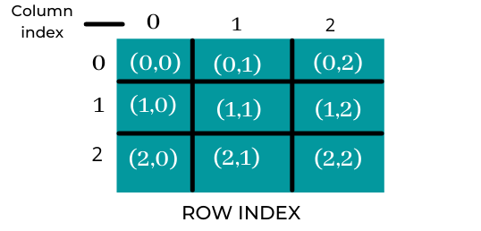
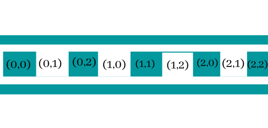
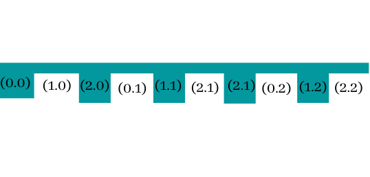

# Arrays

### **Definition**

An Array is a collection of items of same data type stored at contiguous memory locations.


This makes it easier to calculate the position of each element by simply adding an offset to base value, i.e., the memory location of the first element of the array.

It’s used to store multiple items together at one place.

Array elements are generally accessed using index. Generally, in most of the programming languages index begins with Zero.

An array is a linear data structure.

Elements in an array can be stored in two ways.

1. **Homogeneous arrays**:  In which the elements are of the same data type.
2. **Heterogeneous arrays**: In which the elements are of the different data types.

### **Accessing Array Elements**

Arrays allows to access elements randomly. Elements in an array can be accessed using indexes. Suppose an array named **arr** stores N elements. Indexes in an array are in the range of **0 to N-1**, where the first element is present at 0-th index and consecutive elements are placed at consecutive indexes. Element present at ith index in the array **arr[]** can be accessed as arr[i].



### **Usage**

In programming, most of the cases need to store a large amount of data of a similar type. We need to define numerous variables to store such a huge amount of data. While writing the programs, it would be very tough to memorize all variable names. Instead, it is better to define an array and store all the elements in it.

### **Advantages of an Array**

1. Arrays represent multiple data elements of the same type using a single name.
2. Accessing or searching an element in an array is easy by using the index number.
3. An array can be traversed easily just by incrementing the index by 1.
4. Arrays allocate memory in contiguous memory locations for all its data elements.
5. Arrays are cache friendly because items are stored at contiguous memory locations.
6. Arrays allow random access to elements. This makes accessing elements by position faster.

### Types of indexing in an array

1.  0 (zero-based indexing): The first element of the array is indexed by a subscript of 0.
2. 1 (one-based indexing): The first element of the array is indexed by the subscript of 1.
3. n (N-based indexing): The base index of an array can be freely chosen. Usually, programming languages allowing n-based indexing also allow negative index values, and other scalar data types like enumerations, or characters may be used as an array index.

### Categories of arrays

1. Indexed arrays
2. Multidimension arrays
3. Associative arrays

### **Types of arrays**

1. **Static Arrays** - Has the fixed size. It doesn’t resize itself when we add more elements.
2. **Dynamic Arrays** - Has the dynamic size. It resize itself automatically when we add more elements.

# Multi-dimensional arrays

A multi-dimensional array can be termed as an array of arrays that stores data in tabular form. Data in multidimensional arrays are stored in row-major order.

The ***general form of declaring N-dimensional arrays*** is:

```tsx
data_type array_name[size1][size2]....[sizeN];
```

The total number of elements that can be stored in a multidimensional array can be calculated by multiplying the size of all the dimensions.

```tsx
The array int x[10][20] can store total (10*20) = 200 elements.
The array int x[10][20] can store total (10*20) = 200 elements.
```

### **2D Array - Matrix**

2 Dimensional arrays are often defined as an array of arrays. A 2D array is also called a matrix. A matrix can be depicted as a table of rows and columns.

```tsx
int arr[max_rows][max_columns];
```

As in a one-dimensional array, data can be accessed by using only an index, and similarly, in a two-dimensional array, we can access the cells individually by using the indices of the cells. There are two indices attached to a single cell, one is its row number, and the other one is its column number.

```tsx
arr[row_index][column_index]
```

****Mapping 2D to 1D array****

2D arrays are mainly created to implement a database table that look alike data structure. Whilst in computer memory, the storage technique for 2D arrays is similar to that of one-dimensional arrays.

The size of a 2D array is always equivalent to the product of the number of rows and the number of columns present in the array. Thus, we need to map two-dimensional arrays to one-dimensional arrays so as to store them in the memory.



**There are 2 main techniques to map a two-dimensional array to one-dimensional array**

1. **Row Major Ordering:** 
    1. In row-major ordering, all the rows of the two-dimensional array are stored in a contiguous manner in the memory.
    2. First, we insert elements of the 1st row of the 2D array into the memory, followed by the elements of the 2nd row and so on.
    
    
    
2. **Column Major Ordering:** 
    1. In column-major ordering, all the columns of the two-dimensional array are stored in a contiguous manner in the memory.
    2. First, we insert elements of the 1st column of the 2D array into the memory, followed by the elements of the 2nd column, and so on.
    
    
    

### **Terminologies**

- **Square Matrix:** A square Matrix has as many rows as it has columns. i.e. no of rows = no of columns.
- **Symmetric matrix:** A square matrix is said to be symmetric if the transpose of original matrix is equal to its original matrix. i.e. (A) = A.
- **Skew-symmetric:** A skew-symmetric (or antisymmetric or antimetric[1]) matrix is a square matrix whose transpose equals its negative. i.e. (A) = -A.
- **Diagonal Matrix:** A diagonal matrix is a matrix in which the entries outside the main diagonal are all zero. The term usually refers to square matrices.
- **Identity Matrix:** A square matrix in which all the elements of the principal diagonal are ones and all other elements are zeros. Identity matrix is denoted as I.
- **Orthogonal Matrix:** A matrix is said to be orthogonal if AA = AA = I.
- **Idempotent Matrix:** A matrix is said to be idempotent if A = A.
- **Involutory Matrix:** A matrix is said to be Involutory if A = I.
- **Singular Matrix**: A square matrix is said to be singular matrix if its determinant is zero i.e. |A|=0
- **Nonsingular Matrix**: A square matrix is said to be non-singular matrix if its determinant is non-zero.

Every Square Matrix can uniquely be expressed as the sum of a symmetric matrix and skew symmetric matrix. A = 1/2 (AT + A) + 1/2 (A - AT).

**Trace of a matrix:** trace of a matrix is denoted as tr(A) which is used only for square matrix and equals the sum of the diagonal elements of the matrix