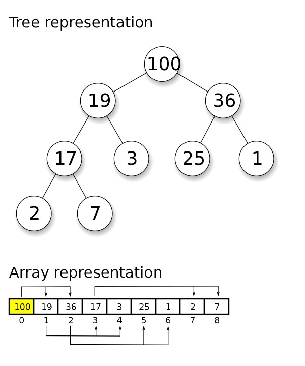
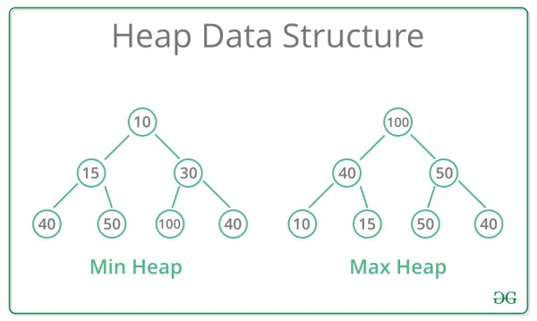

# Heaps

The heap is a special tree-based data structure that satisfies the heap property. It's commonly implemented as a binary tree, either in the form of an array or as a linked structure. Heaps are widely used in various algorithms and applications, such as priority queues and heap sort.

The heap data structure provides efficient operations for maintaining a partially ordered set of elements, making it useful in various algorithms and applications where efficient priority-based operations are required.

Here are the key characteristics of the heap data structure:

1. **Heap Property**: The heap property defines the relationship between parent and child nodes. There are two main types of heaps:
    - Min Heap: In a min heap, for every node i other than the root, the value of the node  must be greater than or equal to the value of its parent node.

        > value(parent(i))≤value(i)
        
    - Max Heap: In a max heap, for every node i other than the root, the value of the node must be less than or equal to the value of its parent node.

        > value(parent(i))≥value(i)

        

2. **Complete Binary Tree Structure**: Heaps are typically implemented as complete binary trees, which means that every level of the tree, except possibly the last one, is completely filled, and the nodes in the last level are filled from left to right.
3. **Array Representation**: Heaps can be efficiently represented using arrays. In this representation, the children of the node at index i are located at indices 2i+1 (left child) and 2i+2 (right child), and the parent of the node at index i is located at index [(i-1)/2].
4. **Operations:**
    - **Insertion**: Adding a new element to the heap while maintaining the heap property.
    - **Deletion**: Removing the root element (minimum or maximum) from the heap while maintaining the heap property.
    - **Heapify**: Ensuring that the heap property is satisfied after an operation such as insertion or deletion.
    - **Extract Minimum/Maximum**: Removing and returning the root element (minimum or maximum) from the heap.
    - **Heap Sort**: Sorting an array using a heap data structure.
5. **Applications:**
    - Priority Queues: Heaps are commonly used to implement priority queues, where elements with higher priority are dequeued before elements with lower priority.
    - Heap Sort: Heapsort is an efficient sorting algorithm based on the heap data structure.
      Dijkstra's Algorithm: Heaps are used to implement the priority queue in Dijkstra's algorithm for finding the shortest path in a graph.
    - Memory Allocation: Heaps are used in memory allocation algorithms to efficiently  
      allocate and deallocate memory blocks.