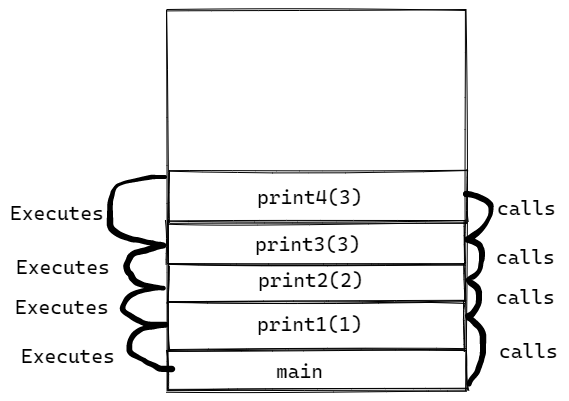
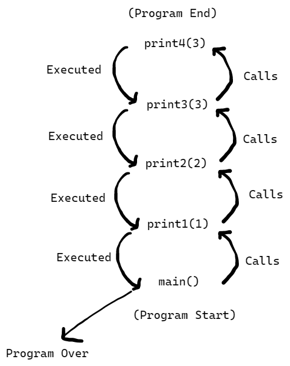

# Recursion

The process in which a function calls itself is called recursion and the corresponding function is called recursive function.

In computer science, **recursion** is a method of solving a computational problem where the solution depends on solutions to smaller instances of the same problem. Recursion solves such recursive problems by using functions that call themselves from within their own code. The approach can be applied to many types of problems, and recursion is one of the central ideas of computer science.

A common algorithm design tactic is to divide a problem into sub-problems of the same type as the original, solve those sub-problems, and combine the results. This is often referred to as the divide-and-conquer method; when combined with a lookup table that stores the results of previously solved sub-problems (to avoid solving them repeatedly and incurring extra computation time), it can be referred to as dynamic programming.

The job of the recursive cases can be seen as breaking down complex inputs into simpler ones. In a properly designed recursive function, with each recursive call, the input problem must be simplified in such a way that eventually the base case must be reached.

It helps us in solving bigger or complex problems in a simple way.

Every recursive program can be written iteratively and vice versa.

Recursion may be simpler, but more intuitive

Recursion may be efficient from programmer point of view.

Recursion may not be efficient from computer point of view.

### Working of function calls (Understanding Call Stack)



- When a function is not finished executing, it will remain in the stack.
- When a function is finished executing, it’s removed from the stack, and the flow of the program is restored to where that function was called.

### Base Condition

Without base condition, a function calls indefinitely and program gets crashed.

Base condition is where recursion stops making new function calls.

In a recursive program, the solution to the base case is provided and the solution of bigger problem is expressed in terms of smaller problems

The idea is to represent a problem in terms of one or more sub problems and add one or more base conditions that stops recursion.

If the case is not reached or not defined then the stack overflow problem may arise.

### How the memory is allocated to different function calls in recursion

When any function is called from main() function, the memory is allocated to it on stack.

A recursive function calls itself, the memory for the called function is allocated on top of memory allocated to the calling function and a different copy of local variables is created for each function call.

When base condition is reached, the function returns its value to the function by whom its called and memory is deallocated and process continues.

### Visualizing Recursion (Recursion Tree)



### **Example:** Find the nth Fibonacci number

0th, 1st, 2nd, 3rd, 4th, 5th, 6th….

0,      1,     2,     3,    5,    8,    13…..

First try to see if there’s a small version of the problem that you can solve.

Try to break it down into smaller problems.

Try to find a relation which repeats between those smaller problems - **Recurrence Relation**

Try to find the base case which stops the recursion.

$Fib(n) = fib(n-1) - fib(n-2)$ - **Recurrence Relation**

**Recursion Tree:**


Usually the program gets executed from left to right. so until and unless the left part of the tree is done the right part of the tree is not executed.

The base condition is represented by answers we already have.

In this, we know that fib(0) = 0, fib(1) =1 - **This is base condition**

```tsx
function fib(n) {
	if (n < 2){
			return n;
	}
	
  return fib(n-1) + fib(n-2)
}
```

## Tail Recursion

A recursive function is said to be following tail recursion if it invokes itself at the end of the function. That’s if all the statements are executed before the function invokes itself then it’s said to be following tail recursion.

```tsx
function print(n) {
	if (n === 0){
			return n;
	}
	console.log(n)
	print(n-1)
}
```

The tail recursive functions are considered better than non-tail recursive functions as tail-recursion can be optimized by the compiler.

The idea used by compilers to optimize tail-recursive functions is simple, since the recursive call is the last statement, there’s nothing left to do in the current function, so saving the current function’s stack frame is of no use.

```tsx
// Non tail recursive
function fact(n) {
	if (n === 0) return 1

	return n * fact(n -1)
}
```

It looks like tail recursive at first look, but it’s non-tail recursive function. If we take closer look, we can see that the value returned by fact(n-1) is not the last thing done by fact (n)

```tsx
// Tail recursive
function fact(n, a) {
	if (n === 0) return a

	return fact(n -1, n * a)
}
```

The above function can be written as tail-recursive function. The idea is to use one more argument and accumulate the factorial value in the second argument.. When ‘n’ reaches 0 returns the accumulated value.

### ****Single recursion and multiple recursion****

Recursion that contains only a single self-reference is known as **single recursion**, while recursion that contains multiple self-references is known as **multiple recursion**. Standard examples of single recursion include list traversal, such as in a linear search, or computing the factorial function, while standard examples of multiple recursion include tree traversal, such as in a depth-first search.

Single recursion is often much more efficient than multiple recursion, and can generally be replaced by an iterative computation, running in linear time and requiring constant space. Multiple recursion, by contrast, may require exponential time and space, and is more fundamentally recursive, not being able to be replaced by iteration without an explicit stack.

Multiple recursion can sometimes be converted to single recursion (and, if desired, thence to iteration). For example, while computing the Fibonacci sequence naively entails multiple iteration, as each value requires two previous values, it can be computed by single recursion by passing two successive values as parameters. This is more naturally framed as co-recursion, building up from the initial values, while tracking two successive values at each step

### How to understand and approach a problem

Identify if you can break down problem into smaller or sub problems.

What is the base case?

What is the smallest amount of work I can do in each iteration?

Write the recurrence relation.

Draw the recursion tree.

- See the flow of the functions, how they are getting into stack.
- Identify and focus on left tree calls and right tree calls.
- Draw the tree and position again and again using pen and paper.
- Use the debugger to see the flow.

See how the values are returned at each step. See where the function call will come out. In the end it will come out of the main function.

See what type of values are returned.

See how the variables are passed, returned and used in the recursive function.

- Arguments
- Return
- Body

## Types of recurrence relation

**1. Linear recurrence relation:**

reduced linearly by adding or subtracting

ex: Fibonacci number

 $fib(n) = fib(n-1)+fib(n-2)$

**2. Divide and conquer recurrence relation**

reduced by a factor

ex: Binary Search

$f(n) = O(1) + f(n/2)$

### Disadvantages of recursion

- Note that both recursive and iterative programs have the same problem solving powers i.e., every program can be written iteratively and vice versa.
- recursive programs usually have greater space requirements than iterative programs as all functions will remain in the stack until the base case is reached.
- A recursive program also has greater time requirements because function calls and return overhead.
- Slowness dues to CPU overhead
- Can be unnecessarily complex if poorly constructed.

### Advantages of recursion

- Recursion provides a clean and simple way to write code.
- It helps us in solving bigger or complex problems in a simple way.
- Bridges the gap between elegance and complexity
- Reduces the need for complex loops and auxiliary data structures.
- Can reduce time complexity easily with memoization
- Some problems are inherently recursive like tree traversals, tower of Hanoi etc. For such problems, it’s preferred to write recursive code. We can write such codes also iteratively with the help of stack data structure.