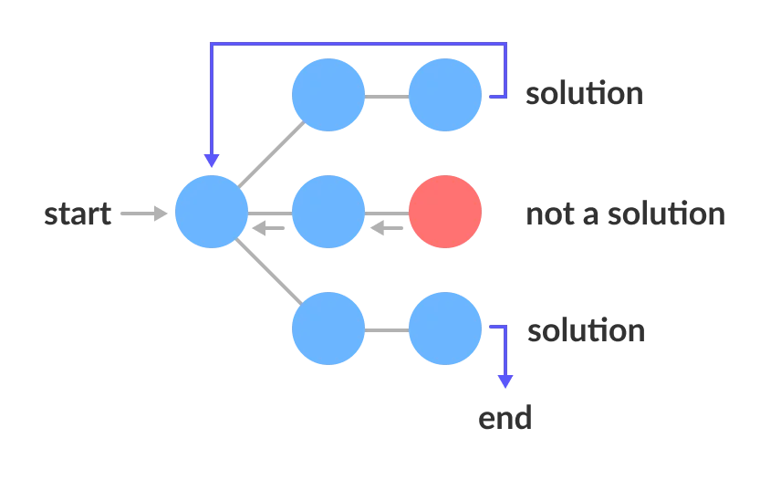

# Backtracking

**Backtracking** can be defined as a general algorithmic technique that considers searching every possible combination in order to solve a computational problem.

It uses a **brute force approach** for finding the desired output.

The term backtracking suggests that if the current solution is not suitable, then backtrack and try other solutions. Thus, recursion is used in this approach.

Backtracking is an algorithmic technique for solving problems recursively by trying to build a solution incrementally, one piece at a time, removing those solutions that fail to satisfy the constraints of the problem at any point of time (by time, here, is referred to the time elapsed till reaching any level of the search tree).

**Backtracking** is a general algorithm for finding solutions to some computational problems, notably constraint satisfaction problems, that incrementally builds candidates to the solutions, and abandons a candidate ("backtracks") as soon as it determines that the candidate cannot possibly be completed to a valid solution.

Backtracking is an important tool for solving constraint satisfaction problems, such as crosswords, verbal arithmetic, Sudoku, and many other puzzles. It is often the most convenient technique for parsing, for the knapsack problem and other combinatorial optimization problems. It is also the basis of the so-called logic programming languages such as Icon, Planner and Prolog.

Backtracking depends on user-given "black box procedures" that define the problem to be solved, the nature of the partial candidates, and how they are extended into complete candidates. It is therefore a metaheuristic rather than a specific algorithm – although, unlike many other meta-heuristics, it is guaranteed to find all solutions to a finite problem in a bounded amount of time.



### Types of backtracking algorithm

1. **Decision Problem** - In this, we search for a feasible solution.
2. **Optimization Problem -** In this, we search for the best solution.
3. **Enumeration Problem -** In this, we find all feasible solutions.

```tsx
Backtrack(x)
	if x is not a solution
		return false
	if x is a new solution
		add to list of solutions
	backtrack(expand x)
```

