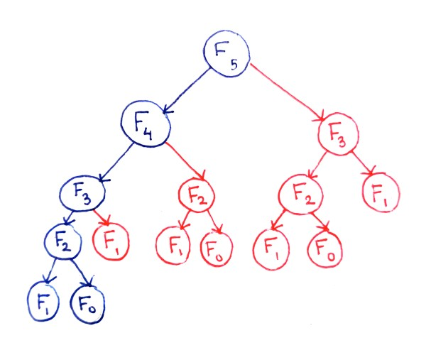

# Dynamic Programming

Dynamic programming is a method for solving complex problems by breaking them down into simpler subproblems and solving each subproblem just once. The key idea behind dynamic programming is to store the results of subproblems so that they can be reused when needed, rather than recalculating them each time they are encountered. This can lead to significant improvements in efficiency for problems with overlapping subproblems.



Dynamic programming typically involves two main steps:

1. **Identifying Optimal Substructure**: 
    This means that an optimal solution to the problem contains optimal solutions to its subproblems. In other words, the problem can be broken down into smaller subproblems, each of which can be solved independently.
2. **Memoization or Tabulation**: 
    Once the subproblems are identified, dynamic programming involves storing the solutions to these subproblems in a data structure (either through memoization, which involves storing solutions to subproblems in a table, or tabulation, which involves building a table of solutions iteratively). This allows the solutions to be reused when needed, avoiding redundant calculations.

Detailed Steps Involved:

1. **Identify Subproblems**: The first step is to decompose the larger problem into smaller, overlapping subproblems.
2. **Define the Base Cases**: These are the simplest subproblems for which the solutions are trivial or readily available.
3. **Build Up Solutions**: Starting with the base cases, use the solutions of smaller subproblems to solve larger and larger subproblems. Store the solutions in a table or array for future reference.
4. **Solve the Original Problem**: Once you've built up the solutions for all subproblems, you can use them to find the optimal solution to the original problem.

Dynamic programming is commonly used to solve optimization problems, such as the shortest path problem, the knapsack problem, and the longest common subsequence problem. It is also used in various other contexts, such as string matching algorithms, sequence alignment, and computational biology.

Dynamic programming is different from divide and conquer in that it typically solves each subproblem just once and stores the solution for future use, whereas divide and conquer may solve the same subproblem multiple times. Additionally, dynamic programming is often used when subproblems overlap, whereas divide and conquer is typically used when subproblems are independent.

Dynamic programming can be implemented using either a top-down approach (memoization) or a bottom-up approach (tabulation), both of which involve storing solutions to subproblems for future use. This optimization technique is particularly useful for problems with overlapping subproblems, where the same subproblem appears multiple times in the recursive solution tree.

A common example of dynamic programming is the Fibonacci sequence, where each number is the sum of the two preceding ones.  The naive recursive approach to calculate the nth Fibonacci number involves redundant calculations. Dynamic programming stores the solutions for smaller Fibonacci numbers and uses them to efficiently calculate larger ones.

### Example: Fibonacci Sequence (Memoization)

```ts
// Function to compute the nth Fibonacci number using memoization
function fib(n: number, memo: { [key: number]: number } = {}): number {
    if (n in memo) {
        return memo[n];
    }
    if (n <= 1) {
        return n;
    }
    // Recursively compute Fibonacci numbers and store the results in the memoization object
    memo[n] = fib(n - 1, memo) + fib(n - 2, memo);
    return memo[n];
}

// Example usage
console.log(fib(10)); // Output: 55
console.log(fib(20)); // Output: 6765
```

### Example: Fibonacci Sequence (Tabulation)

```ts
function fib(n: number): number {
    if (n <= 1) {
        return n;
    }

    // Create an array to store Fibonacci numbers
    const fibTable: number[] = [0, 1];

    // Compute Fibonacci numbers up to n using tabulation
    for (let i = 2; i <= n; i++) {
        fibTable[i] = fibTable[i - 1] + fibTable[i - 2];
    }

    // Return the nth Fibonacci number
    return fibTable[n];
}

// Example usage
console.log(fib(10)); // Output: 55
console.log(fib(20)); // Output: 6765
```

