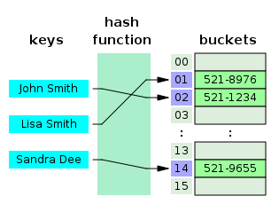

# Hashing

**Hashing** is the process of converting an input of any length into a fixed size string or a number using an algorithm. In hashing, the idea is to use a hash function that converts a given key to a smaller number and uses the small number as an index in a table called a hash table. It’s is a technique that is used to uniquely identify a specific object from a group of similar objects

**A hash table**, also known as **hash map**, is a data structure that implements an associative array or dictionary. It is an abstract data type that maps keys to values. A hash table uses a hash function to compute an *index*, also called a *hash code*, into an array of *buckets* or *slots*, from which the desired value can be found. During lookup, the key is hashed and the resulting hash indicates where the corresponding value is stored.

Ideally, the hash function will assign each key to a unique bucket, but most hash table designs employ an imperfect hash function, which might cause hash *collisions* where the hash function generates the same index for more than one key. Such collisions are typically accommodated in some way.

In a well-dimensioned hash table, the average time complexity for each lookup is independent of the number of elements stored in the table. Many hash table designs also allow arbitrary insertions and deletions of key–value pairs, at amortized constant average cost per operation.

Hashing is an example of a space-time tradeoff. If memory is infinite, the entire key can be used directly as an index to locate its value with a single memory access. On the other hand, if infinite time is available, values can be stored without regard for their keys, and a binary search or linear search can be used to retrieve the element.

In many situations, hash tables turn out to be on average more efficient than search trees or any other table lookup structure. For this reason, they are widely used in many kinds of computer software, particularly for associative arrays, database indexing, caches, and sets

Under reasonable assumptions, the average time required to search for an element in a hash table is **O(1)**

### **Hash function**

A hash function is any function that can be used to map a data set of an arbitrary size to a data set of a fixed size, which falls into the hash table. The values returned by a hash function are called hash values, hash codes, hash sums, or simply hashes.

To achieve a good hashing mechanism, It is important to have a good hash function with the following basic requirements:

1. Easy to compute: It should be easy to compute and must not become an algorithm in itself.
2. Uniform distribution: It should provide a uniform distribution across the hash table and should not result in clustering.
3. Less collisions: Collisions occur when pairs of elements are mapped to the same hash value. These should be avoided.

**Note**: Irrespective of how good a hash function is, collisions are bound to occur. Therefore, to maintain the performance of a hash table, it is important to manage collisions through various collision resolution techniques.

### **Hash Collision**

When the hash function generates the same index for multiple keys, there will be a conflict (what value to be stored in that index). This is called a **hash collision.**

We can resolve the hash collision using one of the following techniques.

- **Chaining (Closed Addressing)** : This process involves building a linked list with key–value pair for each search array index. The collided items are chained together through a single linked list, which can be traversed to access the item with a unique search key. Collision resolution through chaining with linked list is a common method of implementation of hash tables.
    
    
    
    Different data structures for storing chains:
    
    - Linked List - search O(l), Delete O(l), Insert O(l) - Not Cache friendly
    - Dynamic sized Arrays - search O(l), Delete O(l), Insert O(l) - Cache friendly
    - Self Balancing BST (AVL Tree, Red Black Tree) - search O(log l), Delete O(log l), Insert O(log l) -     Not Cache friendly
- **Open Addressing**: It is another collision resolution technique in which every entry records are stored in the bucket array itself, and the hash resolution is performed through **probing**. When a new entry has to be inserted, the buckets are examined, starting with the hashed-to slot and proceeding in some *probe sequence*, until an unoccupied slot is found. When searching for an entry, the buckets are scanned in the same sequence, until either the target record is found, or an unused array slot is found, which indicates an unsuccessful search.
    - **Linear Probing :** Linear probing is when the interval between successive probes is fixed (usually to 1).
        
        
        
        Hash collision is resolved by open addressing with linear probing. Since **CodeMonk** and **Hashing** are hashed to the same index i.e. **2**, store **Hashing** at **3** as the interval between successive probes is **1**.
        
    - **Quadratic Probing  :** Quadratic probing is similar to linear probing and the only difference is the interval between successive probes or entry slots. Here, when the slot at a hashed index for an entry record is already occupied, you must start traversing until you find an unoccupied slot. The interval between slots is computed by adding the successive value of an arbitrary polynomial in the original hashed index.
        - Let hash(x) be the slot index computed using the hash function.
        - If the slot hash(x) % S is full, then we try (hash(x) + 1*1) % S.
        - If (hash(x) + 1*1) % S is also full, then we try (hash(x) + 2*2) % S.
        - If (hash(x) + 2*2) % S is also full, then we try (hash(x) + 3*3) % S.
        - This process is repeated for all the values of i until an empty slot is found.
    - **Double Hashing :**  Double hashing is similar to linear probing and the only difference is the interval between successive probes. Here, the interval between probes is computed by using two hash functions.
        - Double hashing can be done using : ****(hash1(key) + i * hash2(key)) % TABLE_SIZE.** Here hash1() and hash2() are hash functions and TABLE_SIZE is size of hash table. (We repeat by increasing i when collision occurs)
        - The advantage of Double hashing is that it is one of the best form of probing, producing a uniform distribution of records throughout a hash table.
        - This technique does not yield any clusters.
        - It is one of effective method for resolving collisions.