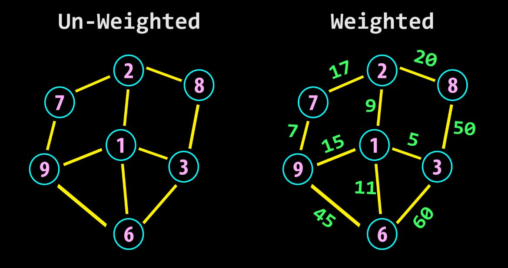

# Graphs

A graph is a data structure that consists of a set of vertices (nodes) and a set of edges connecting these vertices. Graphs are widely used to model relationships between objects, such as social networks, transportation networks, computer networks, and more. They are fundamental in computer science and have numerous applications across various domains.

Graphs can be represented using various data structures, including adjacency matrices, adjacency lists, and edge lists. The choice of data structure depends on factors such as the size of the graph, the density of edges, and the types of operations that need to be performed on the graph.

Here are some key concepts and terminologies associated with graphs:

1. **Vertices** (Nodes): Vertices are the fundamental units of a graph. They represent the entities or objects in the graph. For example, in a social network graph, vertices may represent people, while in a computer network graph, vertices may represent devices.

2. **Edges**: Edges are the connections between vertices. They represent relationships or interactions between the entities represented by the vertices. Edges can be directed (with a specific direction from one vertex to another) or undirected (without any direction).

6. **Adjacency**: Two vertices are said to be adjacent if there is an edge connecting them. The set of vertices adjacent to a particular vertex v is called the adjacency list of v.

7. **Degree**: The degree of a vertex is the number of edges incident to it. In directed graphs, vertices have both an in-degree (number of incoming edges) and an out-degree (number of outgoing edges).

Types of graphs:
1. **Undirected** graphs: Undirected graphs are graphs where the edges between vertices are unidirectional. In other words, the edges are directed from one vertex to another vertex but not the other way around.
2. **Directed** graphs: Directed graphs are graphs where the edges between vertices are bidirectional. In other words, the edges are directed from one vertex to another vertex and the other way around.

    

3. **Weighted** graphs: Weighted graphs are graphs where the weights associated with the edges are used to determine the cost of traversing the edges.
4. **Unweighted** graphs:  An unweighted graph is a type of graph where all the edges have the same weight or no weight at all. In other words, each edge in an unweighted graph is considered to have a uniform weight, typically represented as 1, or no weight is assigned to the edges.

    

5. **Sparse Graph**: A sparse graph is a graph in which the number of edges is much smaller than the maximum possible number of edges. Sparse graphs have relatively few edges compared to the number of vertices.
6. **Dense Graph**: A dense graph is a graph in which the number of edges is close to the maximum possible number of edges. Dense graphs have a large number of edges relative to the number of vertices.
7. **Connected Graph**: A connected graph is a graph in which there is a path between every pair of vertices. In other words, every vertex is reachable from every other vertex.
8. **Disconnected Graph**: A disconnected graph is a graph in which there are two or more disjoint sets of vertices with no paths between them.
9. **Cyclic Graph**: A cyclic graph is a graph that contains at least one cycle, which is a path that starts and ends at the same vertex, traversing through other vertices and edges in between.
10. **Acyclic Graph**: An acyclic graph is a graph that does not contain any cycles. In other words, there are no paths that start and end at the same vertex.

Graphs have numerous applications in computer science, including but not limited to:

1. Routing and network optimization algorithms
2. Social network analysis and recommendation systems
3. Data modeling and database design
4. Compiler design and optimization
5. Image processing and computer vision
6. Game development and pathfinding algorithms